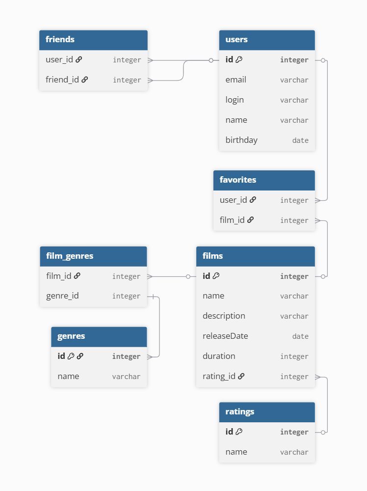

# FilmoRate

Приложение для оценки фильмов и формирования списков рекомендаций на основе отзывов пользователей.

## Схема базы данных

Ниже представлена ER-диаграмма, описывающая структуру таблиц и связей между ними:

### Пояснение к структуре данных:
* **users** — учетные записи пользователей приложения.
* **films** — каталог фильмов, каждый из которых имеет связь с рейтингом MPA (`ratings`).
* **friends** — промежуточная таблица для фиксации связей «дружбы» между пользователями.
* **favorites** — промежуточная таблица лайков, связывающая пользователей и фильмы.
* **film_genres** и **genres** — справочники жанров кино и связи их с фильмами.